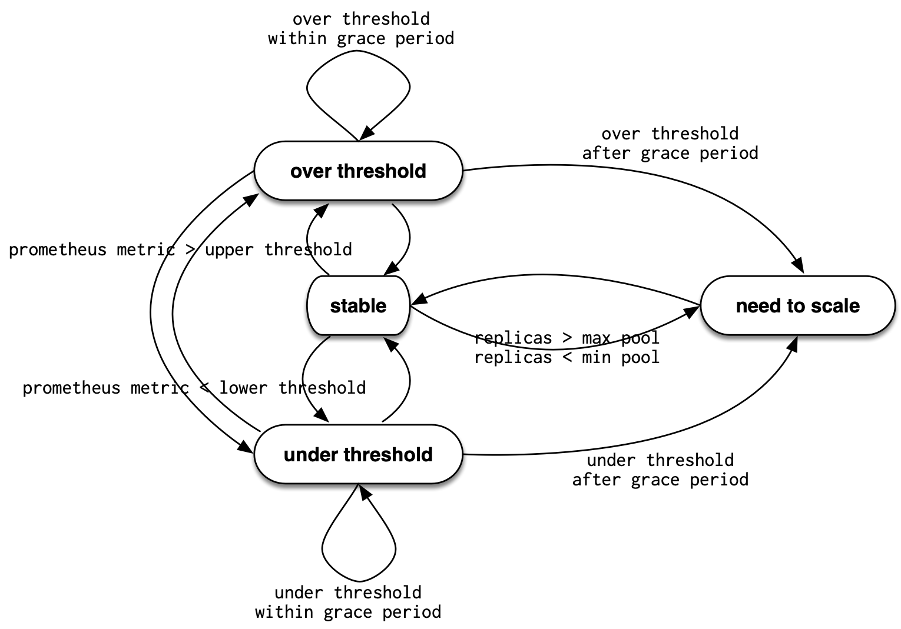

# Auklet Service state

Auklet will start a new monitor goroutine for each service it
finds in the Swarm that has a label `auklet.autoscale` set to
`true`. Within the monitor state is kept in the `Service` struct
that acts as finite state machine. The `Service` states are
modeled as follows:

Transition between states is achieved by emitting an 'event', 
which in Auklet implementation is a simple function call. 
Within the event a decision is made based on information in
the `Service` struct and current/needed state.